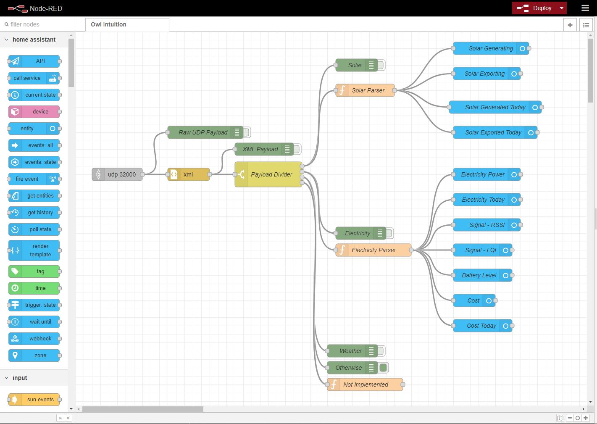

# Node-Red-Owl-Intuition-HomeAssistant

Node Red Parser of Owl Intuition UDP Packets for Home Assistant. Provides monitoring of Electricity and Solar metrics.

This is an alternative to using the [Owl Intuition component via HACS](https://github.com/custom-components/sensor.owlintuition).

The Node-Red flow will sensor entities. The Home Assistant Energy feature assumes that the electricity sensor will measure energy consumed from the grid. Based on the recommended Owl Intuition installation guide, the electricity readings are what the house is using in total, which will be a the sum of Solar and Grid supplied power. To overcome this limitation I've included a example `template` sensor which creates a sensor for calculating the grid electricity usage.

Either add the contents of [energy_owl.yaml](energy_owl.yaml) to your `configuration.yaml` or if you're using packages you can place the file in your packages folder `packages\energy_owl.yaml`
